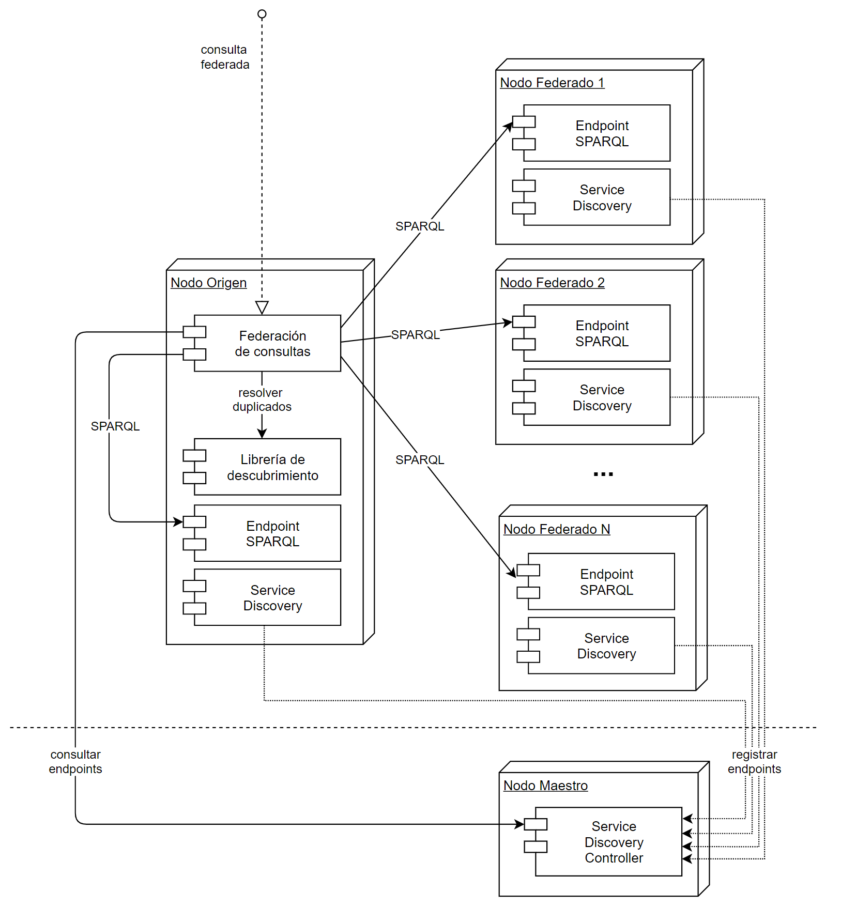

| Entregable     | Procesador de datos                                          |
| -------------- | ------------------------------------------------------------ |
| Fecha          | 17/12/2020                                                   |
| Proyecto       | [ASIO](https://www.um.es/web/hercules/proyectos/asio) (Arquitectura Semántica e Infraestructura Ontológica) en el marco de la iniciativa [Hércules](https://www.um.es/web/hercules/) para la Semántica de Datos de Investigación de Universidades que forma parte de [CRUE-TIC](http://www.crue.org/SitePages/ProyectoHercules.aspx) |
| Módulo         | Federación                                                   |
| Tipo           | Software                                                     |
| Objetivo       | Módulo de Federación para el proyecto Backend SGI (ASIO).    |
| Estado         | Completado al **100%**                                       |
| Próximos pasos | Si fuese necesario añadir mas conectores a datasets de la nube LOD |
| Documentación  | [Manual de usuario](./docs/manual_de_usuario.md) (documentación de alto nivel)<br />[Documentación técnica](./docs/documentacion-tecnica.md) (documentación de bajo nivel)<br/>[Documentación API REST](./docs/documentacion_api_rest_de_la_libreria_de_descubrimiento.md) (documentación de bajo nivel)<br/>[Docker](./docs/docker.md) |


# Módulo de federación

El presente modulo, describe el módulo de Federación.

Este modulo tiene como principal objetivo dar respuesta al requisito de respuesta conjunta de la red HERCULES ante una consulta sobre el sistema a nivel global.

Es también el punto de acceso a los distinto sistemas de almacenamiento de información o incluso a fuentes de datos externas al proyecto, entre ellas:

* Acceso a distintos Triple Stores configurados para el proyecto, pudiendo recuperar la información:
  * En forma tripletas RDF, en cualquiera de los formatos soportados por los endpoint sparql
  * En forma de POJOs o objetos JAVA generalizados, para su uso en la librería de descubrimiento
* Acceso a fuentes de información externas (nube LOD), por medio de conectores, y configurables por medio de ficheros de configuración

El módulo de federación de consultas se subdivide a su vez en tres subsistemas clave:

1. **CONSULTA**: encargado de ejecutar la consulta de forma paralela en todos los nodos de la red y optimización del proceso.
2. **IDENTIFICACIÓN**: se apoya en la librería de descubrimiento para poder identificar entidades repetidas o similares.
3. **AGREGACIÓN**: una vez recibidos los resultados e identificadas las similitudes, se encargaría de unificar los datos de entidades equivalentes obtenidas de diferentes nodos.

Para ello sigue una estrategia P2P, es decir:

* Existirán tantos nodos de Federación como Backend SGI existan desplegados en la solución.
* Es servicio [Service Discovery](https://github.com/HerculesCRUE/ib-service-discovery), será el encargado de conocer la ubicación de todos los nodos de federación que puedan estar desplegados.
* Cualquier nodo de federación, puede actuar como maestro, y actuara siempre como tal el nodo que recibe la consulta.
* Cada nodo de federación (esclavos y maestros), resolverá la consulta de forma local, en los triple stores desplegados en su nodo.
* El nodo de federación que actúa como maestro, orquestara las peticiones al resto de nodos, y agregara las respuestas según lo descrito anteriormente.



## OnBoarding

Para iniciar el entorno de desarrollo se necesita cumplir los siguientes requisitos:

* OpenJDK 11 (en caso de querer JDK8: Oracle JDK 8)
* Eclipse JEE 2019-09 con plugins:
** Spring Tools 4
** m2e-apt
** Lombok
* Docker

También se debe instalar el entorno de desarrollo acorde con lo explicado en: [https://corpus.izertis.com/arquitectura/java/configuracion-del-entorno](https://corpus.izertis.com/arquitectura/java/configuracion-del-entorno)

## OnBoarding

Para iniciar el entorno de desarrollo se necesita cumplir los siguientes requisitos:

* OpenJDK 11 (en caso de querer JDK8: Oracle JDK 8)
* Eclipse JEE 2019-09 con plugins:
  ** Spring Tools 4
  ** m2e-apt
  ** Lombok
* Docker

## Módulos disponibles

* **Módulo back**: módulo que añade una capa de servicios REST a la funcionalidad de la aplicación. Genera un artefacto JAR bootable
* **Módulo service**: módulo que contiene la lógica de la aplicación. Puede ser utilizado como librería independiente para ser integrado en otras aplicaciones

## Metodología de desarrollo

La metodología de desarrollo es Git Flow.

## Entorno de desarrollo Docker

La inicialización de los elementos adicionales al entorno de desarrollo se realiza con docker. 

En el directorio **docker-devenv** se ha configurado un fichero docker-compose.yml para poder arrancar el entorno de desarrollo.

Para arrancar el entorno:

```bash
docker-compose up -d
```

Para pararlo:

```bash
docker-compose down
```

## Swagger

Se ha añadido la posibilidad de utilizar Swagger. Para acceder a Swagger, se utilizará la siguiente URL:

* http://localhost:9328/swagger-ui.html

Para activar swagger se utilizará la variable `app.swagger.enabled`

## Instalación en entorno real

La aplicación se puede configurar por medio del fichero de configuración **application.yml** o mediante variables de entorno.

El fichero de configuración será la configuración usada para cualquier variable de entorno que no este configurada

Será preciso configurar las siguientes variables de entorno cuando se instale en un entorno real (el resto pueden ser cambiadas si se desea en el fichero de configuración y en caso contrarío se usara el valor por defecto):

* Relativas a la Base de datos Relacional

| Variable                                       | Descripción                                           | Valor por defecto                                            |
| ---------------------------------------------- | ----------------------------------------------------- | ------------------------------------------------------------ |
| `APP_PERSISTENCE_DATASOURCE_DRIVER-CLASS-NAME` | Driver usado para la conexión a BBDD Relacional       | org.mariadb.jdbc.Driver                                      |
| `APP_PERSISTENCE_DATASOURCE_USERNAME`          | Usuario para la conexión a BBDD Relacional            | app                                                          |
| `APP_PERSISTENCE_DATASOURCE_PASSWORD`          | Password para la conexión a BBDD Relacional           | sqlpass                                                      |
| `APP_PERSISTENCE_DATASOURCE_URL`               | Cadena de conexión para la conexión a BBDD Relacional | jdbc:mariadb://127.0.0.1:3307/federation?ssl=false&createDatabaseIfNotExist=true |

* Relativas a la configuración de la instancia de Federación (para gestionar el registro en el Service Discovery)

| Variable            | Descripción                                                  | Valor por defecto  |
| ------------------- | ------------------------------------------------------------ | ------------------ |
| `APP_HOST`          | Host donde esta desplegada el nodo de federación. Se debe de facilitar la URL de acceso desde el exterior, ya que el nodo maestro accederá a los distintos módulos por medio de esta URL. Al inicializarse el nodo de Federación, se registrara con estos valores en el Service Discovery. | http://localhost   |
| `APP_PORT`          | Puerto donde el nodo de federación estará escuchando. Dicho puerto ha de estar expuesto hacia el exterior. Al inicializarse el nodo de Federación, se registrara con estos valores en el Service Discovery. | 9328               |
| `APP_NODE`          | Nombre del nodo al que pertenece la instancia de federación. Al inicializarse el nodo de Federación, se registrara con estos valores en el Service Discovery. | um                 |
| `APP_NAME`          | Nombre del servicio de la instancia de federación. En este caso siempre ha de ser **Federation**. Al inicializarse el nodo de Federación, se registrara con estos valores en el Service Discovery. | Federation         |
| `APP_HEATHENDPOINT` | Endpoint donde es posible chequear el estado de la instancia de federación. Al inicializarse el nodo de Federación, se registrara con estos valores en el Service Discovery. | /management/health |
| `APP_TRIPLESTORES`  | Lista de triple stores que se crearan como tipos asociados a el servicio de Federación en el Service Discovery | fuseki             |

* Relativas a la ubicación de los servicios a los que el nodo de Federación debe acceder

| Variable                                       | Descripción                                                  | Valor por defecto     |
| ---------------------------------------------- | ------------------------------------------------------------ | --------------------- |
| `SERVICE_DISCOVERY-HOST`                       | Dirección y puerto donde se encuentra desplegado el servicio Service Discovery | http://localhost:9329 |
| `TRELLIS_HOST`                                 | Dirección y puerto donde se encuentra desplegado el servidor LDP Trellis local | http://localhost      |
| `DATASOURCE_SPARQL_NODENAME`                   | Nombre del nodo donde se encuentran los conectores (en forma de lista) para las conexiones a los endpoint SPARQL | um                    |
| `DATASOURCE_SPARQL_CONECTORS_0_TYPE`           | Tipo de conector del endpoint SPARQL que estamos configurando. Este tipo se registrara al arrancar la aplicación en el Service Discovery, asociado al servicio de Federación | fuseki                |
| `DATASOURCE_SPARQL_CONECTORS_0_HOST`           | Host que usara el conector del endpoint SPARQL que estamos configurando. | fuseki                |
| `DATASOURCE_SPARQL_CONECTORS_0_PORT`           | Puerto que usara el conector del endpoint SPARQL que estamos configurando. | 3030                  |
| `DATASOURCE_SPARQL_CONECTORS_0_SUFFIXURL`      | Sufijo sobre la URL Base, que usara el conector del endpoint SPARQL que estamos configurando. | /trellis/query        |
| `DATASOURCE_SPARQL_CONECTORS_0_QUERYPARAMNAME` | Nombre del parámetro que usa el endpoint SPARQL, para pasar la Query | query                 |

Es muy relevante también la configuración para los conectores que acceden a los distintos datasets de la nube LOD, y que usara la [Librería de descubrimiento](https://github.com/HerculesCRUE/ib-asio-docs-/tree/master/24-Librer%C3%ADa_de_descubrimiento), para la tarea de descubrimiento de enlaces. Podemos encontrar mas información al respecto en la [Documentación técnica](./docs/documentacion-tecnica.md)

