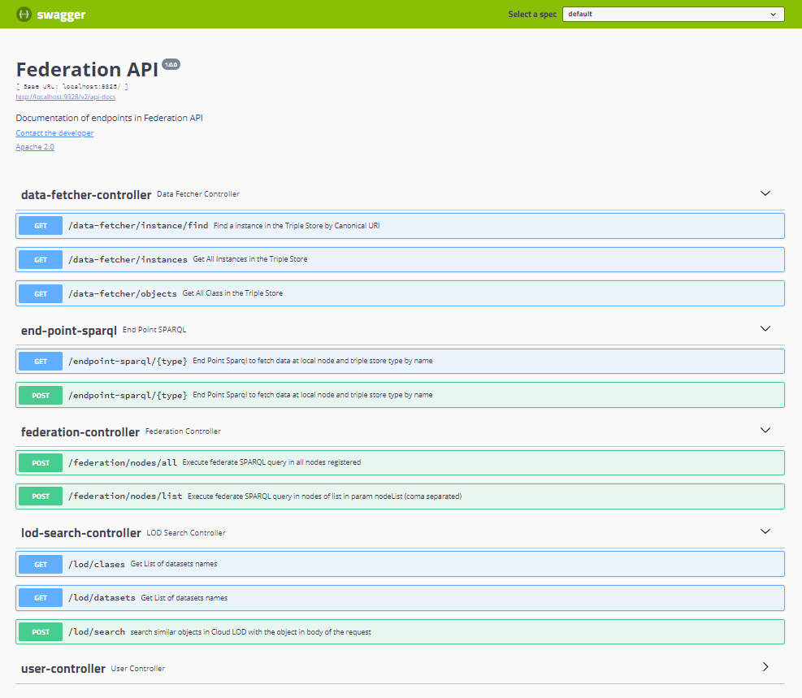

| Entregable     | Procesador de datos                                          |
| -------------- | ------------------------------------------------------------ |
| Fecha          | 17/12/2020                                                   |
| Proyecto       | [ASIO](https://www.um.es/web/hercules/proyectos/asio) (Arquitectura Semántica e Infraestructura Ontológica) en el marco de la iniciativa [Hércules](https://www.um.es/web/hercules/) para la Semántica de Datos de Investigación de Universidades que forma parte de [CRUE-TIC](http://www.crue.org/SitePages/ProyectoHercules.aspx) |
| Módulo         | Federación                                                   |
| Tipo           | Software                                                     |
| Objetivo       | Módulo de Federación para el proyecto Backend SGI (ASIO).    |
| Estado         | Completado al **100%**                                       |
| Próximos pasos | Si fuese necesario añadir mas conectores a datasets de la nube LOD |
| Documentación  | [Manual de usuario](./docs/manual_de_usuario.md) (documentación de alto nivel)<br />[Documentación técnica](./docs/documentacion-tecnica.md) (documentación de bajo nivel)<br/>[Documentación API REST](./docs/documentacion_api_rest_de_la_libreria_de_descubrimiento.md) (documentación de bajo nivel)<br/>[Docker](./docs/docker.md)<br/>[Librería de descubrimiento](https://github.com/HerculesCRUE/ib-discovery<br/>https://github.com/HerculesCRUE/ib-federation<br/>https://github.com/HerculesCRUE/ib-service-discovery)<br/>[Service Discovery](https://github.com/HerculesCRUE/ib-service-discovery) |


## Despliegue

Se puede encontrar documentación exhaustiva de desplieguen en el documento [build](./build.md) tanto para usuarios finales como para desarrolladores.

### Requisitos

* OpenJDK 11
* Maven 3.6.x
* Docker

### Compilación

Para realizar la compilación se ejecutará el siguiente comando:

```bash
mvn clean package
```

También sería posible instalar o desplegar los artefactos sustituyendo `package` por `install` o `deploy` respectivamente.

Los artefactos se generarán dentro del directorio `target` de cada uno de los módulos:

#### Módulo Back

Módulo que añade una capa de servicios REST a la funcionalidad de la aplicación.

Los artefactos se encuentran dentro de federation-back/target

* Artefacto: federation-back-{version}.jar

#### Módulo Service

Módulo que contiene la lógica de la aplicación. Puede ser utilizado como librería independiente para ser integrado en otras aplicaciones

* Los artefactos se encuentran dentro de federation-service/target

  * Artefacto: federation-service-{version}.jar

#### Módulo jpa-abstractions

Módulo con utilidades para el acceso a datos mediante JPA.

#### Módulo service-abstractions

Módulo con utilidades para la generación de servicios.

#### Módulo swagger

Módulo que contiene la funcionalidad necesaria para añadir [Swagger](https://swagger.io/) para la interacción con el API Rest.

#### Módulo audit

Módulo que contiene la funcionalidad necesaria para la generación de datos de auditoría para las tablas de base de datos.

### Ejecución

Al generarse un JAR bootable la ejecución se realizará mediante el siguiente comando:

```bash
java -jar {jar-name}.jar
```

Sustituyendo `{jar-name}` por el nombre del fichero JAR generado.

No es necesario especificar la clase de inicio de la aplicación, ya que el fichero MANIFEST.MF generado ya contiene la información necesaria. Solamente se especificarán los parámetros necesarios.

### Ejecución de test

Los test de integración pueden ejecutarse con el siguiente comando

```bash
mvn clean verify
```

Esto generara reportes sobre el resultado de dichos test, disponibles en la ruta 

```
./target/surefire-reports
```

### Módulos dentro de el servicio de Federación

Como se ha descrito anteriormente, el módulo pretende dar acceso a los datos almacenados en los distintos nodos y triple stores o fuentes externas (Nube LOD), de forma distribuida. Dependiendo de las fuente de la información y del formato de respuesta esperado, existen distintos módulos de la Federación que lo implementan. Entre ellos:

* Módulo **DataFetcher**: Este módulo es el encargado de acceder a la información almacenada en los triple stores definidos, y ofrecerla en el formato de salida apto para ser consumido por la librería de descubrimiento (en formato POJO llamado TripleObject, que esta definido de tal forma que ofrece para cada instancia los metadatos necesarios para la librería de descubrimiento y los atributos modelados de una manera lo suficientemente abstracta, para poder dar cabida a cualquier tipo de datos, incluso listas o objetos anidados, de forma que cualquier objeto modelable por tripletas, pueda ser modelado por este tipo de objeto ). El modulo permite asi desacoplar la fuente de la información de la librería de descubrimiento. Ya que la federación en cualquier caso tiene que responder a consultas sobre toda la información almacenada en los triple stores, y por lo tanto, ha de estar acoplado (por configuración) de algún modo a la fuente de datos, no tiene sentido que otros servicios lo estén. Por otro lado, el módulo DataFetcher, no permite queries libres, ya que su función servir de base de conocimiento para la librería de descubrimiento, solo ofrece endpoint que resuelven las consultas especificas sobre los datos que la librería de descubrimiento necesita hacer (entre ellos obtener todas las entidades en un nodo, todas las instancias para una clase, en un nodo y almacenadas en un triple store especifico, o obtener una instancia concreta, todo ello en el formato usado por la librería de descubrimiento [TripleObject]).
* **Módulo Endpoint SPARQL:** Este módulo resuelve cualquier query en el triple store **local** indicado. Realmente actua como un Proxy hacia el Endpoint SPARQL del triple store y por lo tanto permite la fragmentación de consultas, para evitar colapsos del triple store.
* **Módulo Federación:** Este módulo orquesta las peticiones de forma que sea posible dar una respuesta conjunta de la red HERCULES ante una consulta sobre el sistema a nivel global. Para ello como se ha comentado en este mismo documento, se usa un estrategia P2P, donde el nodo que recibe la consulta actúa como maestro, y por lo tanto orquesta las peticiones a todos los nodos de Federación disponibles (incluido el mismo) haciendo uso del modulo local de Endpoint SPARQL de cada nodo de federación, y agrupa los resultados. Como se ha comentado antes, esto se realiza de forma distribuida y paralelizada, de forma que todas las peticiones a todos los nodos, se gestionan de manera simultanea.
* **Módulo LOD:** Este módulo es el encargado de gestionar las peticiones a los distintos datasets disponibles en la nube LOD. Para ello se apoya en distintos conectores (uno por cada dataset), y un fichero de configuración (disponible en el application.yml) que determina el comportamiento de cada uno de los conectores.

### Implementación

#### Arquitectura

El proyecto esta desarrollado sobre el arquetipo de Izertis para APIs REST, desarrollado sobre el Framework [Spring Boot](https://spring.io/projects/spring-boot), usando el [patrón MVC](https://es.wikipedia.org/wiki/Modelo–vista–controlador).

##### Controladores

Para separar convenientemente los controladores que manejan las peticiones todos ellos se encapsulan en el modulo **federation-back**.

En este caso,existen varios controladores (uno por cada uno de los [módulos](#Módulos-dentro-de-el-servicio-de-Federación) antes descritos), implementado en forma de un API que son los que reciben todas las peticiones por parte de un usuario o otra aplicación:

###### DataFetcherController 

Controlador que gestiona todas las peticiones sobre el módulo DataFetcher de Federación, realizadas por la librería de descubrimiento, entre las que se encuentran:

- **GET /data-fetcher/objects:** Retorna todas las clases (en forma de [URIs canónicas](https://github.com/HerculesCRUE/ib-asio-docs-/blob/master/08-Esquema_de_URIs_H%C3%A9rcules/ASIO_Izertis_ArquitecturaDeURIs.md#esquema-de-uris) ) para un nodo y un triple store concreto.
- **GET /data-fetcher/instances:** Retorna todas las instancias (en forma de objetos [TripleObjectLink](#Modelos)) para un nodo, un triple store y una clase concreta.
- **GET /data-fetcher/instances/find:** Retorna una instancia concreta (en forma de objetos [TripleObjectLink](#Modelos)) para un nodo, un triple store y una clase concreta identificada por su [URI canónica](https://github.com/HerculesCRUE/ib-asio-docs-/blob/master/08-Esquema_de_URIs_H%C3%A9rcules/ASIO_Izertis_ArquitecturaDeURIs.md#esquema-de-uris).

###### EndPointController 

Controlador que gestiona todas las peticiones para los Endpoint SPARQL locales (disponibles en el mismo nodo), y por lo tanto actúa como proxy hacia ellos:

- **GET o POST /end-point-sparql/{type}** Permite ejecutar una consulta en sintaxis SPARQL, contra el triple store indicado mediante el atributo type, recuperando la respuesta de forma homogeneizada según el objeto [CustomRDF](#Modelos).

###### FederationController 

Controlador que gestiona todas las peticiones Federadas para dar una respuesta unificada de las solución ASIO:

- **POST /federation/nodes/all** Permite ejecutar una consulta en sintaxis SPARQL, contra todos de federación contra un triple store determinado, de forma que el nodo que recibe la petición, actúa como maestro orquestando las llamadas a si mismo y al resto de nodos de federación recuperando la respuesta de forma homogeneizada según el objeto [CustomRDF](#Modelos).
- **POST /federation/nodes/all** Permite ejecutar una consulta en sintaxis SPARQL, contra los nodos de federación indicados en el parámetro nodeList contra un triple store determinado, de forma que el nodo que recibe la petición, actúa como maestro orquestando las llamadas a si mismo y al resto de nodos de federación recuperando la respuesta de forma homogeneizada según el objeto [CustomRDF](#Modelos).

###### LODSearchController

Controlador que gestiona todas las peticiones a fuentes de datos externas a la solución ASIO (nube LOD):

- **GET /lod/clases** Permite retornar todas aquellas clases que sus instancias pueden contener posibles enlaces a datos externos, según lo definido en el fichero application.yml en el apartado **lod-data-sources**.
- **GET /lod/clases** Permite retornar todos los datasets externos (nube LOD), según lo definido en el fichero application.yml en el apartado **lod-data-sources** de los que existen conectores y por lo tanto se pueden extraer enlaces.
- **POST /lod/search** Permite ejecutar la búsqueda de enlaces en un dataset concreto (pasado como parámetro), para el objeto pasado como parámetro (en formato [TripleObject](#Modelos)), retornando los enlaces descubiertos en formato  [TripleObjectLink](#Modelos).

##### Servicios

Para separar convenientemente los servicios que contienen la lógica de negocio todos ellos se encapsulan en el modulo **federation-service**, dentro del paquete **service**.

Entre los mas destacados tenemos los siguientes:

###### DataFetcherService

Es el servicio encargado de manejar la lógica de negocio para resolver las consultas al controlador [DataFetcherController](#DataFetcherController)

###### EndPointSparqlService

Es el servicio encargado de manejar la lógica de negocio para resolver las consultas al controlador [EndPointController](#EndPointController)

###### FederationService

Es el servicio encargado de manejar la lógica de negocio para resolver las consultas al controlador [FederationController](#FederationController)

###### FederationServiceHelper

Es el servicio encargado de gestionar la petición de una query SPARQL en un nodo de federación concreto, de forma que la consulta (en caso de retornar potencialmente demasiados resultados) pueda ser dividida en un conjunto de consultas mas pequeñas, para evitar asi sobrecarga en los triple stores.

###### LODHandlerService

Es el servicio encargado de manejar la lógica de negocio para resolver las consultas al controlador [LODSearchController](#LODSearchController)

###### HttpRequestHelper

Es el servicio encargado de proporcionar la logica de negocio común, para realizar todas las peticiones REST necesarias para los distintos componentes de la Federación. 

###### SchemaService

Es el servicio encargado de interactuar con la [Factoria de URIs](https://github.com/HerculesCRUE/ib-uris-generator) e interpretar el [esquema de URIs](https://github.com/HerculesCRUE/ib-asio-docs-/blob/master/08-Esquema_de_URIs_H%C3%A9rcules/ASIO_Izertis_ArquitecturaDeURIs.md#esquema-de-uris) implementado por esta.

###### ServiceDiscoveryHandler

Es el servicio encargado de gestionar el registro del nodo de Federación local en el [Service Discovery](https://github.com/HerculesCRUE/ib-service-discovery) y de esa forma poder ser usado por el resto de nodos de Federación.

###### ServiceDiscoveryService

Es el servicio encargado de interactuar con el [Service Discovery](https://github.com/HerculesCRUE/ib-service-discovery) y de esa forma descubrir la ubicación del resto de módulos de Federación.

###### TextHandleService

Es el servicio encargado de implementar todas las acciones sobre una determinada cadena de texto, principalmente la normalización y la eliminación de Stop Words.

##### Repositorios

Para separar convenientemente los repositorios que interactúan con las fuentes de datos. Estos se encapsulan en el modulo **federation-service**, dentro del paquete **repository**. En este modulo están todos los conectores para los distintos datasets configurados de la nube LOD.

Cada conector esta asociado a la parte de la configuración que lo define dentro del fichero **application.yml**, dentro de la sección **lod-data-sources (datasets)**.

Este fichero determina el comportamiento de el conector, tanto en la fase de captura de información desde la fuente de datos, como en la fase de transformación de la información recuperada y la creación de la respuesta. 

Hasta ahora, están implementados todos los conectores descritos en la [documentación de la librería de descubrimiento](https://github.com/HerculesCRUE/ib-asio-docs-/blob/master/24-Librer%C3%ADa_de_descubrimiento/ASIO_Libreria_de_descubrimiento.md#descubrimiento-de-enlaces), siendo posible en el futuro, añadir aquellos que sean necesarios.

Se detalla un poco mas en profundad en el siguiente punto. 

##### Nube LOD

Como se ha comentado en el punto anterior, el comportamiento de los conectores, viene determinado en gran grado, por la configuración presente en el fichero **application.yml**, dentro de la sección **lod-data-sources (datasets)**.

Por lo tanto, es conveniente profundizar un poco en dicha configuración


###### LodDataSources

Esta clase modela la entidad raíz de todos los datasources definidos

**Atributos**

* **datasets:** Lista de Objetos de tipo [Dataset](#Dataset) definidos en la configuración.

###### Dataset

Esta clase modela un dataset concreto (SCOPUS, WIKIDATA ....).

**Atributos**

* **name:** Nombre del dataset.

* **conections:** Lista de Objetos de tipo [Connection](#Connection) definidos en la configuración.

###### Connection

Esta clase modela un canal por el cual se puede acceder a la información contenida en el dataset. Por ejemplo un canal podría ser una conexión API y otro canal podría ser un Endpoint SPARQL. Es posible configurar varios canales, y por lo tanto se debe de definir prioridad entre ellos

**Atributos**

* **connectionType:** Enumerado. Tipo de conexión [API,SPARQL] para conectar por medio de API o de endpoint SPARQL. Los conectores de cada dataset, implementaran cada uno de ellos, si procede.

* **def:** Booleano. Este atributo determina si el tipo de conexión definido por el atributo connectionType es la conexión por defecto, es decir la primera de la lista de conexiones que se debe de usar para obtener los datos. El resto de conexiones definidas, solo se usaran cuando la conexión por defecto, falle o no obtenga ningún resultado.
* **baseURL:** String. Este atributo establece la cadena de conexión a el API o el Endpoint SPARQL definido para la conexión.
* **apiKey:** String. API Key o token del API o del endpoint SPARQL para obtener los datos.
* **mappings:** Lista de Objetos de tipo [Mapping](#Mapping) definidos en la configuración.

###### Mapping

Esta clase modela los atributos necesarios para definir el comportamiento de un conector en su interacción cualquier API o endpoint SPARQL, para un obtener datos de un dataset remoto.

**Atributos**

* **remoteName:** String. Nombre del objeto remoto del que obtendremos información. Tambien sirve para alimentar los metadatos de información en la respuesta que generemos.

* **remoteAttribute:** String. Nombre del atributo remoto por el cual realizaremos la búsqueda a través del API o endpoint SPARQL que enlazaremos con los atributos de el [LocalClass](#LocalClass) que será explicado más adelante.
* **suffixURL:** String. Sufijo de la URL que final que se formara por la unión de baseURL +  suffixURL para atacar al API o el Endpoint SPARQL definido para la conexión.
* **identifier:** Boolean. Si es True, indica que el atributo a enlazar definido en [LocalClass](#LocalClass) es un identificador, y por lo tanto la búsqueda en el dataset, tiene que ser por la coincidencia exacta de dicho atributo. En caso contrario, no será considerado un identificador y por lo tanto la búsqueda, puede realizarse por semejanza.
* **order:** Integer. Determina el orden por el que se ejecutaran los distintos [Mappings](#Mapping) que pudiese haber para un mismo [Connection](#Connection).
* **paramType**: Enumerado [URI,QUERY,SPARQL]. Determina si el atributo del objeto remoto definido por su remoteName, debe de atacarse por la construcción de una petición donde el remoteAttribute sea usado como un URL parameter, un query parameter o como parte de una query SPARQL.
* **localClasses:** Lista de Objetos de tipo [LocalClass](#LocalClass) definidos en la configuración.

###### LocalClass

Esta clase modela los atributos necesarios para definir la relación de un objeto [Mapping](#Mapping), con la/s clase/s locales para el proyecto ASIO y definidas por la ontología.

**Atributos**

* **name:** String. Nombre local de la clase dentro de el proyecto ASIO y definida por la ontología.

* **attributes:** Lista de String. Nombre de los atributos de la clase local, que están relacionados con los atributos (remoteAttribute) de la clase remota (remoteName) definida en el objeto [Mapping](#Mapping) padre. 
* **mappers:** Lista de Objetos de tipo [Mapper](#Mapper) definidos en la configuración.

###### Mapper

Esta clase modela el mapeado entre los atributos que retornara la búsqueda de similitud entre el objeto remoto y el objeto local.

**Atributos**

* **remoteAttribute:** String. Nombre del atributo remoto que se mapeara con el atributo local.

* **localAttribute:** String. Nombre del atributo local que se mapeara con el atributo remoto.

##### Modelos

* Se usa un modelo de datos Relacional para modelar entidades relativas a la auditoria de la aplicación.

* Se usan modelos de datos para modelar la las estructuras de datos que comparten el modulo de federación y la librería de descubrimiento entre ellas:
  * **TripleObjectSimplified:** Que básicamente modela un objeto para contener las instancias recuperadas de el tiple store, con capacidad de modelar los metadatos, y los datos, con un nivel de abstracción y generalización suficiente para dar soporte a cualquier grafo que pudiese estar definido por las tripletas. Este objeto es equivalente a el Objeto [TripleObject](https://github.com/HerculesCRUE/ib-discovery/blob/master/docs/documentacion-tecnica.md#modelo-de-datos-general) implementado en la librería de descubrimiento, por lo que el paso de uno a otro, es trivial.
  * **TripleObjectLink:** Representa una extensión del objeto **TripleObjectSimplified**, aplicable a fuentes de datos externas (nube LOD). Básicamente tiene la misma estructura que este, pero integra algunos metadatos adicionales, como por ejemplo los enlaces hacia la información, los prefijos semánticos usados y mapeadores para la conversión entre un objeto TripleObjectLink y un objeto TripleObjectSimplified.
* También se usa un modelo de datos para estandarizar las respuestas de los distintos endpoint SPARQL, hacia una respuesta común. Para ello usa las clases:
  * **CustomTriplet:** Que modela una única tripleta RDF
  * **CustomObject:** Que modela la colección de tripletas (CustomTriplet), que definen una determinada instancia.
  * **CustomRDF:** Que modela la respuesta estandarizada que se obtendrá para cualquier llamada a la Federación .

### Metodología de desarrollo

La metodología de desarrollo es [Git Flow](https://www.atlassian.com/es/git/tutorials/comparing-workflows/gitflow-workflow).

### Entorno de desarrollo Docker

La generación de la imagen Docker y su despliegue están descritas en el documento [Generación Docker](./docker.md)

También es necesario desplegar el entorno de servicios necesarios, por ejemplo MariaDB.

Para ello existe en el directorio **docker-devenv** el dichero docker-compose.yml que despliega dicho entorno. 

También puede ser necesario desplegar los triple stores, para ello podemos encontrar la carpeta **trellis-fuseki** dentro de la carpeta **docker-devenv**.

Para ello es suficiente ejecutar los siguientes comandos:

 Para arrancar el entorno:

```bash
docker-compose up -d
```

Para pararlo:

```bash
docker-compose down
```

### Variables de entorno

La aplicación se puede configurar por medio del fichero de configuración **application.yml** o mediante variables de entorno.

El fichero de configuración será la configuración usada para cualquier variable de entorno que no este configurada

Será preciso configurar las siguientes variables de entorno cuando se instale en un entorno real (el resto pueden ser cambiadas si se desea en el fichero de configuración y en caso contrarío se usara el valor por defecto):

* Relativas a la Base de datos Relacional

| Variable                                       | Descripción                                           | Valor por defecto                                            |
| ---------------------------------------------- | ----------------------------------------------------- | ------------------------------------------------------------ |
| `APP_PERSISTENCE_DATASOURCE_DRIVER-CLASS-NAME` | Driver usado para la conexión a BBDD Relacional       | org.mariadb.jdbc.Driver                                      |
| `APP_PERSISTENCE_DATASOURCE_USERNAME`          | Usuario para la conexión a BBDD Relacional            | app                                                          |
| `APP_PERSISTENCE_DATASOURCE_PASSWORD`          | Password para la conexión a BBDD Relacional           | sqlpass                                                      |
| `APP_PERSISTENCE_DATASOURCE_URL`               | Cadena de conexión para la conexión a BBDD Relacional | jdbc:mariadb://127.0.0.1:3307/federation?ssl=false&createDatabaseIfNotExist=true |

* Relativas a la configuración de la instancia de Federación (para gestionar el registro en el Service Discovery)

| Variable            | Descripción                                                  | Valor por defecto  |
| ------------------- | ------------------------------------------------------------ | ------------------ |
| `APP_HOST`          | Host donde esta desplegada el nodo de federación. Se debe de facilitar la URL de acceso desde el exterior, ya que el nodo maestro accederá a los distintos módulos por medio de esta URL. Al inicializarse el nodo de Federación, se registrara con estos valores en el Service Discovery. | http://localhost   |
| `APP_PORT`          | Puerto donde el nodo de federación estará escuchando. Dicho puerto ha de estar expuesto hacia el exterior. Al inicializarse el nodo de Federación, se registrara con estos valores en el Service Discovery. | 9328               |
| `APP_NODE`          | Nombre del nodo al que pertenece la instancia de federación. Al inicializarse el nodo de Federación, se registrara con estos valores en el Service Discovery. | um                 |
| `APP_NAME`          | Nombre del servicio de la instancia de federación. En este caso siempre ha de ser **Federation**. Al inicializarse el nodo de Federación, se registrara con estos valores en el Service Discovery. | Federation         |
| `APP_HEATHENDPOINT` | Endpoint donde es posible chequear el estado de la instancia de federación. Al inicializarse el nodo de Federación, se registrara con estos valores en el Service Discovery. | /management/health |
| `APP_TRIPLESTORES`  | Lista de triple stores que se crearan como tipos asociados a el servicio de Federación en el Service Discovery | fuseki             |

* Relativas a la ubicación de los servicios a los que el nodo de Federación debe acceder

| Variable                                       | Descripción                                                  | Valor por defecto     |
| ---------------------------------------------- | ------------------------------------------------------------ | --------------------- |
| `SERVICE_DISCOVERY-HOST`                       | Dirección y puerto donde se encuentra desplegado el servicio Service Discovery | http://localhost:9329 |
| `TRELLIS_HOST`                                 | Dirección y puerto donde se encuentra desplegado el servidor LDP Trellis local | http://localhost      |
| `DATASOURCE_SPARQL_NODENAME`                   | Nombre del nodo donde se encuentran los conectores (en forma de lista) para las conexiones a los endpoint SPARQL | um                    |
| `DATASOURCE_SPARQL_CONECTORS_0_TYPE`           | Tipo de conector del endpoint SPARQL que estamos configurando. Este tipo se registrara al arrancar la aplicación en el Service Discovery, asociado al servicio de Federación | fuseki                |
| `DATASOURCE_SPARQL_CONECTORS_0_HOST`           | Host que usara el conector del endpoint SPARQL que estamos configurando. | fuseki                |
| `DATASOURCE_SPARQL_CONECTORS_0_PORT`           | Puerto que usara el conector del endpoint SPARQL que estamos configurando. | 3030                  |
| `DATASOURCE_SPARQL_CONECTORS_0_SUFFIXURL`      | Sufijo sobre la URL Base, que usara el conector del endpoint SPARQL que estamos configurando. | /trellis/query        |
| `DATASOURCE_SPARQL_CONECTORS_0_QUERYPARAMNAME` | Nombre del parámetro que usa el endpoint SPARQL, para pasar la Query | query                 |

### Swagger

Se desplegara un API Swagger automáticamente al desplegar el proyecto.

El API esta disponible en

[http://{HOST_FEDERACION}:[SWAGGER_PORT]/swagger-ui.html](http://localhost:9329/swagger-ui.html)

Para activar Swagger se utilizará la variable `app.swagger.enabled`


## API REST de Federación

El API Rest en su totalidad se encuentra documentado, mediante Swagger.

Swagger se desplegara de forma automática,  al ejecutar el proyecto, en el mismo host y el mismo puerto configurado en el application.yml.

Por lo tanto se podrá acceder a Swagger mediante una URL de es siguiente formato:  

[http://{HOST_FEDERACION}:[SWAGGER_PORT]/swagger-ui.html](http://localhost:9329/swagger-ui.html)

En caso de ejecutar en la maquina local, con la configuración presente actualmente en el fichero application.yml, la URI resultante será

http://localhost:9328/swagger-ui.html

Obteniendo el siguiente resultado



Por otro lado, puede encontrarse una documentación exhaustiva de los Endpoint desplegados por el API, en el documento

[Documentación API REST](./documentacion_api_rest.md)