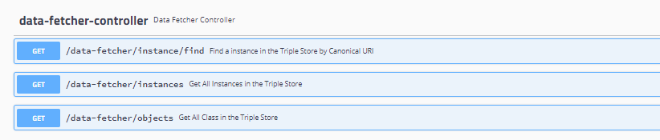
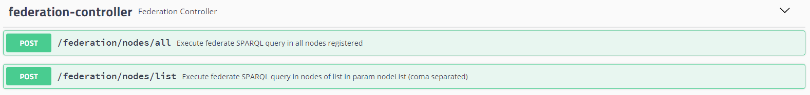
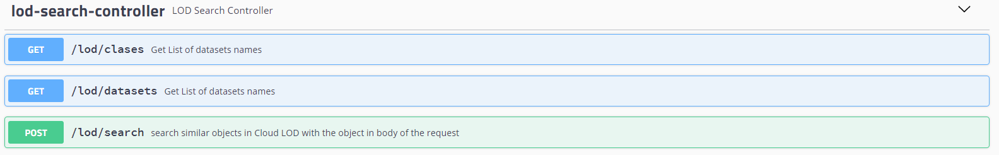

| Entregable     | Procesador de datos                                          |
| -------------- | ------------------------------------------------------------ |
| Fecha          | 17/12/2020                                                   |
| Proyecto       | [ASIO](https://www.um.es/web/hercules/proyectos/asio) (Arquitectura Semántica e Infraestructura Ontológica) en el marco de la iniciativa [Hércules](https://www.um.es/web/hercules/) para la Semántica de Datos de Investigación de Universidades que forma parte de [CRUE-TIC](http://www.crue.org/SitePages/ProyectoHercules.aspx) |
| Módulo         | Federación                                                   |
| Tipo           | Software                                                     |
| Objetivo       | Módulo de Federación para el proyecto Backend SGI (ASIO).    |
| Estado         | Completado al **100%**                                       |
| Próximos pasos | Si fuese necesario añadir mas conectores a datasets de la nube LOD |
| Documentación  | [Manual de usuario](./docs/manual_de_usuario.md) (documentación de alto nivel)<br />[Documentación técnica](./docs/documentacion-tecnica.md) (documentación de bajo nivel)<br/>[Documentación API REST](./docs/documentacion_api_rest_de_la_libreria_de_descubrimiento.md) (documentación de bajo nivel)<br/>[Docker](./docker.md)<br/>[Librería de descubrimiento](https://github.com/HerculesCRUE/ib-discovery<br/>https://github.com/HerculesCRUE/ib-federation<br/>https://github.com/HerculesCRUE/ib-service-discovery)<br/>[Service Discovery](https://github.com/HerculesCRUE/ib-service-discovery) |

# API REST de Federación

La documentación de esta sección hará referencia a cada uno de los EndPoints desplegados por el modulo de federación, apoyándose en la documentación proporcionada por Swagger, por lo tanto los enlaces que se facilitan para los EndPoint descritos en Swagger, solo estarán disponibles si se ha realizado el despliegue, y dicho despliegue se ha realizado en la misma máquina donde se encuentra la presente documentación. En otro caso es necesario cambiar el host y el puerto por aquellos donde la librería de URIs ha sido desplegada.

La librería de descubrimiento despliega los siguientes EndPoints:

## API REST del módulo DataFetcher

### Implementación

Es implementado por el controlador DataFetcherController descrito en la [seccion controladores, de la documentacion tecnica](./documentacion-tecnica.md#DataFetcherController) 

### EndPoints



#### GET /data-fetcher/instances

Disponible en Swagger el siguiente [enlace](http://localhost:9328/swagger-ui.html#/data-fetcher-controller/getFindInstanceByURIUsingGET)

**Semántica**

Permite obtener una lista de las clases (sus URIs canónicas), disponibles en un determinado nodo

**PETICIÓN:**

```
curl -X GET "http://localhost:9328/data-fetcher/objects?node=um&service=Federation&tripleStore=fuseki" -H "accept: */*"
```

**PARÁMETROS:**

* **node:**  (Requerido). Nodo donde realizaremos las consulta.
* **service:**  (Requerido).Servicio donde ejecutaremos las consulta. En este caso siempre Federation ya que la realizaremos a partir de módulo de federación.
* **tripleStore:**  (Requerido). Triple store del cual queremos obtener los resultados.

**RESPUESTA**

```
[
  "http://hercules.org/um/es-ES/rec/Project-Expense",
  "http://hercules.org/um/es-ES/rec/International-Project",
  "http://hercules.org/um/es-ES/rec/Funding-Source",
  "http://hercules.org/um/es-ES/rec/Book-Section",
  "http://hercules.org/um/es-ES/rec/Person",
  "http://hercules.org/um/es-ES/rec/Doctoral-Thesis",
  "http://hercules.org/um/es-ES/rec/Dossier",
  "http://hercules.org/um/es-ES/rec/Project",
  "http://hercules.org/um/es-ES/rec/Book-Chapter",
  "http://hercules.org/um/es-ES/rec/Research-Accreditation",
  "http://hercules.org/um/es-ES/rec/Project-Contract",
  "http://hercules.org/um/es-ES/rec/Research-Group",
  "http://hercules.org/um/es-ES/rec/Article",
  "http://hercules.org/um/es-ES/rec/Book",
  "http://hercules.org/um/es-ES/rec/Editor-Role",
  "http://hercules.org/um/es-ES/rec/University",
  "http://hercules.org/um/es-ES/rec/Invoice",
  "http://hercules.org/um/es-ES/rec/Patent",
  "http://hercules.org/um/es-ES/rec/Master-Thesis",
  "http://hercules.org/um/es-ES/rec/Exhibit",
  "http://hercules.org/um/es-ES/rec/Organization",
  "http://hercules.org/um/es-ES/rec/Conference",
  "http://hercules.org/um/es-ES/rec/Funding"
]
```


#### GET /data-fetcher/instances

Disponible en Swagger el siguiente [enlace](http://localhost:9328/swagger-ui.html#/data-fetcher-controller/getFindInstanceByURIUsingGET)

**Semántica**

- Permite obtener una lista de las instancias, disponibles en un determinado nodo y para la clase indicada por parámetro

**PETICIÓN:**

```
curl -X GET "http://localhost:9328/data-fetcher/instances?className=University&node=um&service=Federation&tripleStore=fuseki" -H "accept: */*"
```

**PARÁMETROS:**

* **className:** (Requerido). Nombre de la clase de la cual queremos obtener todas sus instancias.
* **node:**  (Requerido). Nodo donde realizaremos las consulta.
* **service:**  (Requerido).Servicio donde ejecutaremos las consulta. En este caso siempre Federation ya que la realizaremos a partir de módulo de federación.
* **tripleStore:**  (Requerido). Triple store del cual queremos obtener los resultados.

**RESPUESTA**

```
[
  {
    "id": "c81e728d-9d4c-3f63-af06-7f89cc14862c",
    "localURI": "http://localhost/University/c81e728d-9d4c-3f63-af06-7f89cc14862c",
    "className": "University",
    "node": "um",
    "tripleStore": "fuseki",
    "lastModification": 1612520899774,
    "attributes": {
      "localId": "2",
      "name": "Universidad Complutense de Madrid"
    }
  },
  {
    "id": "c4ca4238-a0b9-3382-8dcc-509a6f75849b",
    "localURI": "http://localhost/University/c4ca4238-a0b9-3382-8dcc-509a6f75849b",
    "className": "University",
    "node": "um",
    "tripleStore": "fuseki",
    "lastModification": 1612520625948,
    "attributes": {
      "localId": "1",
      "name": "Universidad de Murcia"
    }
  },
  {
    "id": "eccbc87e-4b5c-32fe-a830-8fd9f2a7baf3",
    "localURI": "http://localhost/University/eccbc87e-4b5c-32fe-a830-8fd9f2a7baf3",
    "className": "University",
    "node": "um",
    "tripleStore": "fuseki",
    "lastModification": 1612521185901,
    "attributes": {
      "localId": "3",
      "name": "Universidad de Oviedo"
    }
  }
]
```

#### GET /data-fetcher/instance/find

Disponible en Swagger el siguiente [enlace](http://localhost:9328/swagger-ui.html#/data-fetcher-controller/getFindInstanceByURIUsingGET)

**Semántica**

- Permite obtener una determinada de las instancia, disponibles en un determinado nodo y para la clase indicada por parámetro y con la URI canonica también indicada

**PETICIÓN:**

```
curl -X GET "http://localhost:9328/data-fetcher/instance/find?className=University&node=um&service=Federation&tripleStore=fuseki&uri=http%3A%2F%2Fhercules.org%2Fum%2FEs-es%2FUniversity%2Fc81e728d-9d4c-3f63-af06-7f89cc14862c" -H "accept: */*"
```

**PARÁMETROS:**

* **className:** (Requerido). Nombre de la clase de la cual queremos obtener todas sus instancias.
* **node:**  (Requerido). Nodo donde realizaremos las consulta.
* **service:**  (Requerido).Servicio donde ejecutaremos las consulta. En este caso siempre Federation ya que la realizaremos a partir de módulo de federación.
* **tripleStore:**  (Requerido). Triple store del cual queremos obtener los resultados.
* **uri:**  (Requerido). URI canónica de la instancia buscada.

**RESPUESTA**

```

{
    "id": "c81e728d-9d4c-3f63-af06-7f89cc14862c",
    "localURI": "http://localhost/University/c81e728d-9d4c-3f63-af06-7f89cc14862c",
    "className": "University",
    "node": "um",
    "tripleStore": "fuseki",
    "lastModification": 1612520899774,
    "attributes": {
        "localId": "2",
        "name": "Universidad Complutense de Madrid"
    }
}
```

## API REST del módulo Endpoint SPARQL

### Implementación

Es implementado por el controlador DataFetcherController descrito en la [seccion controladores, de la documentacion tecnica](./documentacion-tecnica.md#EndPointController) 

### EndPoints


#### GET /endpoint-sparql/{type}

Disponible en Swagger el siguiente [enlace](http://localhost:9328/swagger-ui.html#/end-point-sparql/executeQueryInTripleStoreUsingGET)

**Semántica**

Permite ejecutar una query en sintaxis SPARQL contra cualquiera de los endpoint SPARQL de cualquiera de los triple stores desplegados en el mismo nodo (por ejemplo dentro de la universidad de Murcia)

**PETICIÓN:**

```
curl -X GET "http://localhost:9328/endpoint-sparql/fuseki?nodeTimeout=60000&pageSize=1000&query=SELECT%20%3Fa%20%3Fb%20%3Fc%20WHERE%20%7B%20%3Fa%20%3Fb%20%3Fc%20%7D%20limit%201" -H "accept: */*"
```

**PARÁMETROS:**

* **Authorization:**  Header (Requerido). Autorización (si fuese necesaria), que será usada en la petición contra el endpoint SPARQL.
* **nodeTimeout:** Query Parameter. (Requerido). Tiempo máximo permitido para obtener una respuesta del endpoint SPARQL. En caso de no ser recibida, se cancelara la consulta.
* **pageSize:** Query Parameter.  (Requerido). Tamaño máximo de resultados permitidos para una sola consulta SPARQL. Si la consulta retorna mas resultados, la query original se dividirá en en distintas sub queries, de forma que el numero de resultados de cada una nunca sea mayor al definido por el parámetro. Durante el proceso de agregación, se realizara la unión de todos los resultados de todas las subconsultas, de forma que se obtendrá el resultado total. Esto hace protege al los endpoint SPARQL ante peticiones masivas, aunque puede aumentar un poco la latencia. 
* **query: ** Query Parameter. (Requerido). La query en sintaxis SPARQL, que queremos ejecutar.
* **type:** Query Parameter. (Requerido). El nombre del triple store local donde queremos ejecutar la consulta.

**RESPUESTA**

```
{
  "head": {
    "vars": [
      "a",
      "b",
      "c"
    ]
  },
  "results": {
    "bindings": [
      {
        "a": {
          "type": "uri",
          "value": "trellis:data/"
        },
        "b": {
          "type": "uri",
          "value": "http://purl.org/dc/terms/modified"
        },
        "c": {
          "type": "literal",
          "datatype": "http://www.w3.org/2001/XMLSchema#dateTime",
          "value": "2021-02-24T16:52:36.766226Z"
        }
      }
    ]
  },
  "stats": {
    "node": "um",
    "url": "http://localhost:3030/trellis/query",
    "delay": "24",
    "status": "COMPLETED",
    "description": "Fully Completed",
    "successPages": 1,
    "failsPages": 0,
    "nullsPages": 0,
    "totalResults": 1
  }
}
```

#### POST /endpoint-sparql/{type}

Disponible en Swagger el siguiente [enlace](http://localhost:9328/swagger-ui.html#/end-point-sparql/executeQueryPostInTripleStoreUsingPOST)

**Semántica**

Permite ejecutar una query en sintaxis SPARQL contra cualquiera de los endpoint SPARQL de cualquiera de los triple stores desplegados en el mismo nodo (por ejemplo dentro de la universidad de Murcia)

**PETICIÓN:**

```
curl -X POST "http://localhost:9328/endpoint-sparql/fuseki?nodeTimeout=60000&pageSize=1000" -H "accept: */*" -H "Content-Type: text/plain" -d "SELECT ?a ?b ?c WHERE { ?a ?b ?c } limit 1"
```

**PARÁMETROS:**

* **Authorization:**  Header (Requerido). Autorización (si fuese necesaria), que será usada en la petición contra el endpoint SPARQL.
* **nodeTimeout:** Query Parameter. (Requerido). Tiempo máximo permitido para obtener una respuesta del endpoint SPARQL. En caso de no ser recibida, se cancelara la consulta.
* **pageSize:** Query Parameter.  (Requerido). Tamaño máximo de resultados permitidos para una sola consulta SPARQL. Si la consulta retorna mas resultados, la query original se dividirá en en distintas sub queries, de forma que el numero de resultados de cada una nunca sea mayor al definido por el parámetro. Durante el proceso de agregación, se realizara la unión de todos los resultados de todas las subconsultas, de forma que se obtendrá el resultado total. Esto hace protege al los endpoint SPARQL ante peticiones masivas, aunque puede aumentar un poco la latencia. 
* **query: ** Body. (Requerido). La query en sintaxis SPARQL, que queremos ejecutar.
* **type:** Query Parameter. (Requerido). El nombre del triple store local donde queremos ejecutar la consulta.

**RESPUESTA**

```
{
  "head": {
    "vars": [
      "a",
      "b",
      "c"
    ]
  },
  "results": {
    "bindings": [
      {
        "a": {
          "type": "uri",
          "value": "trellis:data/"
        },
        "b": {
          "type": "uri",
          "value": "http://purl.org/dc/terms/modified"
        },
        "c": {
          "type": "literal",
          "datatype": "http://www.w3.org/2001/XMLSchema#dateTime",
          "value": "2021-02-24T16:52:36.766226Z"
        }
      }
    ]
  },
  "stats": {
    "node": "um",
    "url": "http://localhost:3030/trellis/query",
    "delay": "28",
    "status": "COMPLETED",
    "description": "Fully Completed",
    "successPages": 1,
    "failsPages": 0,
    "nullsPages": 0,
    "totalResults": 1
  }
}
```


## API REST del módulo Federation

### Implementación

Es implementado por el controlador DataFetcherController descrito en la [seccion controladores, de la documentacion tecnica](./documentacion-tecnica.md#FederationController) 

### EndPoints



#### POST /federation/nodes/all

Disponible en Swagger el siguiente [enlace](http://localhost:9328/swagger-ui.html#/federation-controller/executeQueryInAllNodesUsingPOST)

**Semántica**

Permite ejecutar una query en sintaxis SPARQL contra todos los nodos de federación que estén desplegados. Esto hará que cada nodo de federación resuelva la query de forma local, y que el resultado de todos los nodos sea agrupado por el nodo que recibió la consulta.

**PETICIÓN:**

```
curl -X POST "http://localhost:9328/federation/nodes/all?nodeTimeout=60000&pageSize=1000&query=SELECT%20%3Fa%20%3Fb%20%3Fc%20WHERE%20%7B%3Fa%20%3Fb%20%3Fc%7D%20limit%201&tripleStore=fuseki" -H "accept: */*"
```

**PARÁMETROS:**

* **Authorization:**  Header (Requerido). Autorización (si fuese necesaria), que será usada en la petición contra el endpoint SPARQL.
* **nodeTimeout:** Query Parameter. (Requerido). Tiempo máximo permitido para obtener una respuesta del endpoint SPARQL. En caso de no ser recibida, se cancelara la consulta.
* **pageSize:** Query Parameter.  (Requerido). Tamaño máximo de resultados permitidos para una sola consulta SPARQL. Si la consulta retorna mas resultados, la query original se dividirá en en distintas sub queries, de forma que el numero de resultados de cada una nunca sea mayor al definido por el parámetro. Durante el proceso de agregación, se realizara la unión de todos los resultados de todas las subconsultas, de forma que se obtendrá el resultado total. Esto hace protege al los endpoint SPARQL ante peticiones masivas, aunque puede aumentar un poco la latencia. 
* **query: ** Body. (Requerido). La query en sintaxis SPARQL, que queremos ejecutar.
* **tripleStore:** Query Parameter. (Requerido). El nombre de los triple store donde queremos ejecutar la consulta.

**RESPUESTA**

```
{
  "head": {
    "vars": [
      "a",
      "b",
      "c"
    ]
  },
  "stats": [
    {
      "node": "um",
      "url": "http://localhost:9328/endpoint-sparql/fuseki",
      "delay": "21",
      "status": "COMPLETED",
      "description": "Fully Completed",
      "successPages": 1,
      "failsPages": 0,
      "nullsPages": 0,
      "totalResults": 1
    },
    {
      "node": "um2",
      "url": "http://localhost:9328/endpoint-sparql/fuseki",
      "delay": "22",
      "status": "COMPLETED",
      "description": "Fully Completed",
      "successPages": 1,
      "failsPages": 0,
      "nullsPages": 0,
      "totalResults": 1
    }
  ],
  "results": {
    "bindings": [
      {
        "a": {
          "type": "uri",
          "value": "trellis:data/"
        },
        "b": {
          "type": "uri",
          "value": "http://purl.org/dc/terms/modified"
        },
        "c": {
          "type": "literal",
          "value": "2021-02-24T16:52:36.766226Z"
        },
        "nodes": [
          {
            "node": "um",
            "url": "http://localhost:9328/endpoint-sparql/fuseki"
          },
          {
            "node": "um2",
            "url": "http://localhost:9328/endpoint-sparql/fuseki"
          }
        ]
      }
    ]
  }
}
```

#### POST /federation/nodes/list

Disponible en Swagger el siguiente [enlace](http://localhost:9328/swagger-ui.html#/federation-controller/executeQueryInNodesListUsingPOST)

**Semántica**

Permite ejecutar una query en sintaxis SPARQL contra todos los nodos de federación indicados en la petición. Esto hará que cada nodo de federación resuelva la query de forma local, y que el resultado de todos los nodos sea agrupado por el nodo que recibió la consulta.

**PETICIÓN:**

```
curl -X POST "http://localhost:9328/federation/nodes/list?nodeList=um%2C%20um2&nodeTimeout=60000&pageSize=1000&query=SELECT%20%3Fa%20%3Fb%20%3Fc%20WHERE%20%7B%3Fa%20%3Fb%20%3Fc%7D%20limit%201&tripleStore=fuseki" -H "accept: */*"
```

**PARÁMETROS:**

* **Authorization:**  Header (Requerido). Autorización (si fuese necesaria), que será usada en la petición contra el endpoint SPARQL.
* **nodeList:** Query Parameter. (Requerido). Lista de nodos (separados por comas) donde se ejecutara la consulta.
* **nodeTimeout:** Query Parameter. (Requerido). Tiempo máximo permitido para obtener una respuesta del endpoint SPARQL. En caso de no ser recibida, se cancelara la consulta.
* **pageSize:** Query Parameter.  (Requerido). Tamaño máximo de resultados permitidos para una sola consulta SPARQL. Si la consulta retorna mas resultados, la query original se dividirá en en distintas sub queries, de forma que el numero de resultados de cada una nunca sea mayor al definido por el parámetro. Durante el proceso de agregación, se realizara la unión de todos los resultados de todas las subconsultas, de forma que se obtendrá el resultado total. Esto hace protege al los endpoint SPARQL ante peticiones masivas, aunque puede aumentar un poco la latencia. 
* **query: ** Body. (Requerido). La query en sintaxis SPARQL, que queremos ejecutar.
* **tripleStore:** Query Parameter. (Requerido). El nombre de los triple store donde queremos ejecutar la consulta.

**RESPUESTA**

```
{
  "head": {
    "vars": [
      "a",
      "b",
      "c"
    ]
  },
  "stats": [
    {
      "node": "um",
      "url": "http://localhost:9328/endpoint-sparql/fuseki",
      "delay": "45",
      "status": "COMPLETED",
      "description": "Fully Completed",
      "successPages": 1,
      "failsPages": 0,
      "nullsPages": 0,
      "totalResults": 1
    },
    {
      "node": "um2",
      "url": "http://localhost:9328/endpoint-sparql/fuseki",
      "delay": "24",
      "status": "COMPLETED",
      "description": "Fully Completed",
      "successPages": 1,
      "failsPages": 0,
      "nullsPages": 0,
      "totalResults": 1
    }
  ],
  "results": {
    "bindings": [
      {
        "a": {
          "type": "uri",
          "value": "trellis:data/"
        },
        "b": {
          "type": "uri",
          "value": "http://purl.org/dc/terms/modified"
        },
        "c": {
          "type": "literal",
          "value": "2021-02-24T16:52:36.766226Z"
        },
        "nodes": [
          {
            "node": "um2",
            "url": "http://localhost:9328/endpoint-sparql/fuseki"
          },
          {
            "node": "um",
            "url": "http://localhost:9328/endpoint-sparql/fuseki"
          }
        ]
      }
    ]
  }
}
```

## API REST del módulo LOD (búsqueda de enlaces en la nube LOD)

### Implementación

Es implementado por el controlador DataFetcherController descrito en la [seccion controladores, de la documentacion tecnica](./documentacion-tecnica.md#LODSearchController) 

### EndPoints



#### GET /lod/clases

Disponible en Swagger el siguiente [enlace](http://localhost:9328/swagger-ui.html#/lod-search-controller/getDataSetClassNamesUsingGET)

**Semántica**

Permite retornar una lista de todas las clases (según la ontología ASIO) que están definidas en los ficheros de configuración, de las cuales se pueden obtener enlaces en la nube LOD.

**PETICIÓN:**

```
curl -X GET "http://localhost:9328/lod/clases" -H "accept: */*"
```

**RESPUESTA**

```
[
  "DoctoralThesis",
  "Persona",
  "Book",
  "Article",
  "BookChapter",
  "Journal",
  "Documento",
  "BookSection",
  "MasterThesis",
  "Person",
  "Magazine"
]
```

#### GET /lod/datasets

Disponible en Swagger el siguiente [enlace](http://localhost:9328/swagger-ui.html#/lod-search-controller/getDataSetClassNamesUsingGET)

**Semántica**

Permite retornar una lista de todos los datasets definidos en los ficheros de configuración de las cuales se pueden obtener enlaces en la nube LOD.

**PETICIÓN:**

```
curl -X GET "http://localhost:9328/lod/clases" -H "accept: */*"
```

**RESPUESTA**

```
[
  "ORCID",
  "DOAJ",
  "CROSSREF",
  "WIKIDATA",
  "SCOPUS",
  "DBLP",
  "PUBMED"
]
```

#### POST /lod/search

Disponible en Swagger el siguiente [enlace](http://localhost:9328/swagger-ui.html#/federation-controller/executeQueryInAllNodesUsingPOST)

**Semántica**

Permite realizar una búsqueda de similitudes en el/los dataset/s indicado/s de la nube LOD, para el objeto en formato [TripleObject](https://github.com/HerculesCRUE/ib-discovery/blob/master/docs/documentacion-tecnica.md#modelo-de-datos) comprensible por la [librería de descubrimineto](https://github.com/HerculesCRUE/ib-asio-docs-/blob/master/24-Librer%C3%ADa_de_descubrimiento/ASIO_Libreria_de_descubrimiento.md).

**PETICIÓN:**

```
curl -X POST "http://localhost:9328/lod/search?dataSets=SCOPUS" -H "accept: */*" -H "Content-Type: application/json" -d "{\"localURI\": \"http://herc-iz-front-desa.atica.um.es/Articulo/94eb3174-c69b-3a2a-a3e3-ebf3d6605d8b\",\"className\": \"Article\",\"lastModification\": 1434060000000,\"tripleStore\":{\"id\": null,\"name\": \"sparql\",\"baseURL\": null,\"user\": null,\"password\": null,\"node\":{\"nodeName\": \"um\"}},\"attributes\":{\"localId\": \"51260\",\"año\": \"2011\",\"coautoria\": \"N\",\"title\": \"Implementation of a new modular facility to detoxify agro-wastewater polluted with neonicotinoid insecticides in farms by solar photocatalysis\"}}"
```

**PARÁMETROS:**

* **dataSets:**  Query Params (Requerido). Listado de datasets (separados por comas) donde se realzara/n la/s búsqueda/s .
* **obj:** Query Parameter. (Requerido). Tiempo máximo permitido para obtener una respuesta del endpoint SPARQL. En caso de no ser recibida, se cancelara la consulta.
* **pageSize:** Query Parameter.  (Requerido). Tamaño máximo de resultados permitidos para una sola consulta SPARQL. Si la consulta retorna mas resultados, la query original se dividirá en en distintas sub queries, de forma que el numero de resultados de cada una nunca sea mayor al definido por el parámetro. Durante el proceso de agregación, se realizara la unión de todos los resultados de todas las subconsultas, de forma que se obtendrá el resultado total. Esto hace protege al los endpoint SPARQL ante peticiones masivas, aunque puede aumentar un poco la latencia. 
* **obj: ** Body. (Requerido). Objeto en formato [TripleObject](https://github.com/HerculesCRUE/ib-discovery/blob/master/docs/documentacion-tecnica.md#modelo-de-datos) del cual buscaremos similaridades en los datasets.

```
{
  "localURI": "http://herc-iz-front-desa.atica.um.es/Articulo/94eb3174-c69b-3a2a-a3e3-ebf3d6605d8b",
  "className": "Article",
  "lastModification": 1434060000000,
  "tripleStore": {
    "id": null,
    "name": "sparql",
    "baseURL": null,
    "user": null,
    "password": null,
    "node": {
      "nodeName": "um"
    }
  },
  "attributes": {
    "localId": "51260",
    "año": "2011",
    "coautoria": "N",
    "title": "Implementation of a new modular facility to detoxify agro-wastewater polluted with neonicotinoid insecticides in farms by solar photocatalysis"
  }
}
```


* **tripleStore:** Query Parameter. (Requerido). El nombre de los triple store donde queremos ejecutar la consulta.

**RESPUESTA**

```
[
  {
    "id": "SCOPUS_ID:85064015825",
    "datasetName": "SCOPUS",
    "baseURL": "https://api.elsevier.com/content/",
    "remoteName": "SCOPUS",
    "localClassName": "Article",
    "mapper": {
      "dc:title": "title",
      "doi": "doi"
    },
    "prefixes": {
      "default": "http://scopus.com/",
      "prism": "http://prismstandard.org/namespaces/1.2/basic/",
      "dc": "http://purl.org/dc/elements/1.1/"
    },
    "origin": {
      "id": null,
      "localURI": "http://herc-iz-front-desa.atica.um.es/Articulo/94eb3174-c69b-3a2a-a3e3-ebf3d6605d8b",
      "className": "Article",
      "node": "um",
      "tripleStore": "sparql",
      "lastModification": 1434060000000,
      "attributes": {
        "localId": "51260",
        "año": "2011",
        "coautoria": "N",
        "title": "Implementation of a new modular facility to detoxify agro-wastewater polluted with neonicotinoid insecticides in farms by solar photocatalysis"
      }
    },
    "links": [
      {
        "type": "self",
        "link": "https://api.elsevier.com/content/abstract/scopus_id/85064015825"
      },
      {
        "type": "author-affiliation",
        "link": "https://api.elsevier.com/content/abstract/scopus_id/85064015825?field=author,affiliation"
      },
      {
        "type": "scopus",
        "link": "https://www.scopus.com/inward/record.uri?partnerID=HzOxMe3b&scp=85064015825&origin=inward"
      },
      {
        "type": "scopus-citedby",
        "link": "https://www.scopus.com/inward/citedby.uri?partnerID=HzOxMe3b&scp=85064015825&origin=inward"
      },
      {
        "type": "full-text",
        "link": "https://api.elsevier.com/content/article/eid/1-s2.0-S0360544219305341"
      }
    ],
    "attributes": {
      "@_fa": "true",
      "prism:url": "https://api.elsevier.com/content/abstract/scopus_id/85064015825",
      "dc:identifier": "SCOPUS_ID:85064015825",
      "eid": "2-s2.0-85064015825",
      "dc:title": "Implementation of a new modular facility to detoxify agro-wastewater polluted with neonicotinoid insecticides in farms by solar photocatalysis",
      "dc:creator": "Fenoll J.",
      "prism:publicationName": "Energy",
      "prism:issn": "03605442",
      "prism:volume": "175",
      "prism:pageRange": "722-729",
      "prism:coverDate": "2019-05-15",
      "prism:coverDisplayDate": "15 May 2019",
      "prism:doi": "10.1016/j.energy.2019.03.118",
      "pii": "S0360544219305341",
      "citedby-count": "9",
      "affiliation": [
        {
          "@_fa": "true",
          "affilname": "Sustainability and Quality Group of Fruit and Vegetable Products. Murcia Institute of Agri-Food Research and Development",
          "affiliation-city": "Murcia",
          "affiliation-country": "Spain"
        }
      ],
      "prism:aggregationType": "Journal",
      "subtype": "ar",
      "subtypeDescription": "Article",
      "source-id": "29348",
      "openaccess": "0",
      "openaccessFlag": false
    }
  }
]
```

#### 