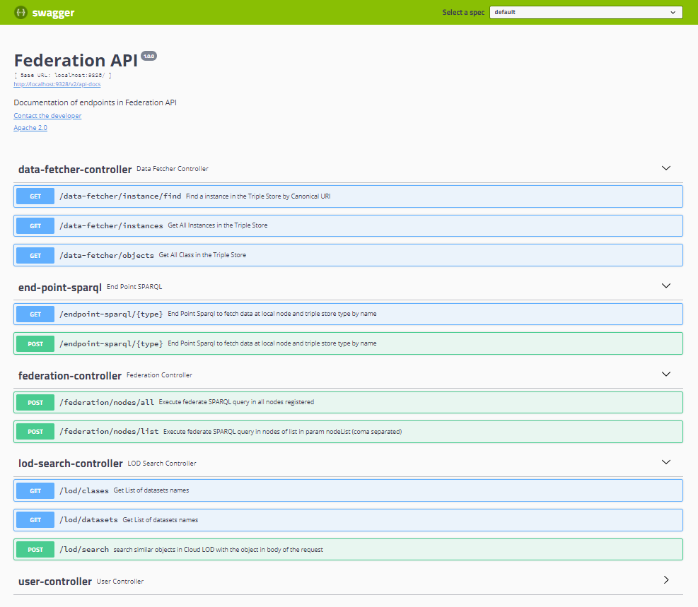

| Entregable     | Procesador de datos                                          |
| -------------- | ------------------------------------------------------------ |
| Fecha          | 17/12/2020                                                   |
| Proyecto       | [ASIO](https://www.um.es/web/hercules/proyectos/asio) (Arquitectura Semántica e Infraestructura Ontológica) en el marco de la iniciativa [Hércules](https://www.um.es/web/hercules/) para la Semántica de Datos de Investigación de Universidades que forma parte de [CRUE-TIC](http://www.crue.org/SitePages/ProyectoHercules.aspx) |
| Módulo         | Federación                                                   |
| Tipo           | Software                                                     |
| Objetivo       | Módulo de Federación para el proyecto Backend SGI (ASIO).    |
| Estado         | Completado al **100%**                                       |
| Próximos pasos | Si fuese necesario añadir mas conectores a datasets de la nube LOD |
| Documentación  | [Manual de usuario](./docs/manual_de_usuario.md) (documentación de alto nivel) [Documentación técnica](./docs/documentacion-tecnica.md) (documentación de bajo nivel) [Documentación API REST](./docs/documentacion_api_rest_de_la_libreria_de_descubrimiento.md) (documentación de bajo nivel) [Docker](./docs/docker.md) [Librería de descubrimiento](https://github.com/HerculesCRUE/ib-discovery https://github.com/HerculesCRUE/ib-federation https://github.com/HerculesCRUE/ib-service-discovery) [Service Discovery](https://github.com/HerculesCRUE/ib-service-discovery) |

# Manual de usuario

El presente documento realiza una descripción de el servicio de **Federación** a alto nivel, por lo tanto, se complementa con el documento de [Documentación técnica](./documentacion-tecnica.md) que la describe a bajo nivel.

Este modulo tiene como principal objetivo dar respuesta al requisito de respuesta conjunta de la red HERCULES ante una consulta sobre el sistema a nivel global.

Es también el punto de acceso a los distinto sistemas de almacenamiento de información o incluso a fuentes de datos externas al proyecto, entre ellas:

* Acceso a distintos Triple Stores configurados para el proyecto, pudiendo recuperar la información:
  * En forma tripletas RDF, en cualquiera de los formatos soportados por los endpoint sparql
  * En forma de POJOs o objetos JAVA generalizados, para su uso en la librería de descubrimiento
* Acceso a fuentes de información externas (nube LOD), por medio de conectores, y configurables por medio de ficheros de configuración

El módulo de federación de consultas se subdivide a su vez en tres subsistemas clave:

1. **CONSULTA**: encargado de ejecutar la consulta de forma paralela en todos los nodos de la red y optimización del proceso.
2. **IDENTIFICACIÓN**: se apoya en la librería de descubrimiento para poder identificar entidades repetidas o similares.
3. **AGREGACIÓN**: una vez recibidos los resultados e identificadas las similitudes, se encargaría de unificar los datos de entidades equivalentes obtenidas de diferentes nodos.

Para ello sigue una estrategia P2P, es decir:

* Existirán tantos nodos de Federación como Backend SGI existan desplegados en la solución.
* Es servicio [Service Discovery](https://github.com/HerculesCRUE/ib-service-discovery), será el encargado de conocer la ubicación de todos los nodos de federación que puedan estar desplegados.
* Cualquier nodo de federación, puede actuar como maestro, y actuara siempre como tal el nodo que recibe la consulta.
* Cada nodo de federación (esclavos y maestros), resolverá la consulta de forma local, en los triple stores desplegados en su nodo.
* El nodo de federación que actúa como maestro, orquestara las peticiones al resto de nodos, y agregara las respuestas según lo descrito anteriormente.

## Despliegue

Se puede encontrar documentación exhaustiva de desplieguen en el documento [build](./build.md) tanto para usuarios finales como para desarrolladores.

## Entorno

El servicio de Federación, tiene dependencias con las siguientes herramientas:

* [MariaDB](https://mariadb.org/): Base de datos relacional, para aspectos relacionados con la auditoría.
* [Service Discovery](https://github.com/HerculesCRUE/ib-service-discovery): Servicio de descubrimiento, para conocer otras instancias de el servicio de federación
* [Trellis](https://github.com/trellis-ldp/trellis): Servidor LDP, asociado a Fuseki.
* [Fuseki](https://jena.apache.org/documentation/fuseki2/): Servidor SPARQL, para el acceso a los datos almacenados en TDB.
* [Wikibase](https://en.wikipedia.org/wiki/Wikibase): Solución de Mediawiki, para el almacenamiento y gestión de datos semánticos.  

Se puede encontrar información sobre el despliegue del entorno el el documento [build.md (seccion Despliegue del entorno)](https://github.com/HerculesCRUE/ib-discovery/blob/master/docs/build.md#Despliegue-del-entorno)

## Estrategias para gestión de grandes volúmenes de datos

La decisión de implementar el módulo de Federación como una solución P2P distribuida, hace que la misma sea mas robusta a grandes consultas de datos. 

Asimismo la implementación de las peticiones a cada uno de los nodos de Federación, orquestada por el nodo maestro, se realiza siempre de forma paralelizada y asíncrona, de forma que el tiempo total de necesario para realizar la consulta no es la suma de los tiempos de la consulta en cada uno de los nodos, sino solamente el tiempo de la consulta mas lenta (y el tiempo necesario para realizar la agrupación de resultados).

Además de ello, se ha implementado de forma que sea posible limitar los siguientes aspectos:

* **Tiempo de respuesta:** El parámetro **nodeTimeout**, disponible en cualquiera de los endpoint de consulta que ofrece el modulo de federación determina el tiempo máximo para esperar una respuesta para cada uno de los nodos. En caso de ser superado en cualquiera de los nodos, la query será abortada en dicho nodo y se podrá conocer este hecho consultando las estadísticas de ejecución en cada nodo.
*  **Fragmentación de query:** el parámetro **pageSize**, disponible en cualquiera de los endpoint de consulta que ofrece el modulo de federación, permite fragmentar una query que potencialmente retornara un numero muy elevado de resultados en varias queries menores (con un máximo de tripletas según indique el parámetro). Los resultados de esas queries fragmentadas se ofrecerán como un solo resultado, en el resultado final.

## Módulos dentro de el servicio de Federación

Como se ha descrito anteriormente, el módulo pretende dar acceso a los datos almacenados en los distintos nodos y triple stores o fuentes externas (Nube LOD), de forma distribuida. Dependiendo de las fuente de la información y del formato de respuesta esperado, existen distintos módulos de la Federación que lo implementan. Entre ellos:

* Módulo **DataFetcher**: Este módulo es el encargado de acceder a la información almacenada en los triple stores definidos, y ofrecerla en el formato de salida apto para ser consumido por la librería de descubrimiento (en formato POJO llamado TripleObject, que esta definido de tal forma que ofrece para cada instancia los metadatos necesarios para la librería de descubrimiento y los atributos modelados de una manera lo suficientemente abstracta, para poder dar cabida a cualquier tipo de datos, incluso listas o objetos anidados, de forma que cualquier objeto modelable por tripletas, pueda ser modelado por este tipo de objeto ). El modulo permite asi desacoplar la fuente de la información de la librería de descubrimiento. Ya que la federación en cualquier caso tiene que responder a consultas sobre toda la información almacenada en los triple stores, y por lo tanto, ha de estar acoplado (por configuración) de algún modo a la fuente de datos, no tiene sentido que otros servicios lo estén. Por otro lado, el módulo DataFetcher, no permite queries libres, ya que su función servir de base de conocimiento para la librería de descubrimiento, solo ofrece endpoint que resuelven las consultas especificas sobre los datos que la librería de descubrimiento necesita hacer (entre ellos obtener todas las entidades en un nodo, todas las instancias para una clase, en un nodo y almacenadas en un triple store especifico, o obtener una instancia concreta, todo ello en el formato usado por la librería de descubrimiento [TripleObject]).
* **Módulo Endpoint SPARQL:** Este módulo resuelve cualquier query en el triple store **local** indicado. Realmente actua como un Proxy hacia el Endpoint SPARQL del triple store y por lo tanto permite la fragmentación de consultas, para evitar colapsos del triple store.
* **Módulo Federación:** Este módulo orquesta las peticiones de forma que sea posible dar una respuesta conjunta de la red HERCULES ante una consulta sobre el sistema a nivel global. Para ello como se ha comentado en este mismo documento, se usa un estrategia P2P, donde el nodo que recibe la consulta actúa como maestro, y por lo tanto orquesta las peticiones a todos los nodos de Federación disponibles (incluido el mismo) haciendo uso del modulo local de Endpoint SPARQL de cada nodo de federación, y agrupa los resultados. Como se ha comentado antes, esto se realiza de forma distribuida y paralelizada, de forma que todas las peticiones a todos los nodos, se gestionan de manera simultanea.
* **Módulo LOD:** Este módulo es el encargado de gestionar las peticiones a los distintos datasets disponibles en la nube LOD. Para ello se apoya en distintos conectores (uno por cada dataset), y un fichero de configuración (disponible en el application.yml) que determina el comportamiento de cada uno de los conectores.

## API REST del módulo Service Discovery

El API Rest en su totalidad se encuentra documentado, mediante Swagger.

Swagger se desplegara de forma automática,  al ejecutar el proyecto, en el mismo host y el mismo puerto configurado en el application.yml.

Por lo tanto se podrá acceder a Swagger mediante una URL de es siguiente formato:  

[http://{HOST_SERVICE_DISCOVERY}:[SWAGGER_PORT]/swagger-ui.html](http://localhost:9329/swagger-ui.html)

En caso de ejecutar en la maquina local, con la configuración presente actualmente en el fichero application.yml, la URI resultante será

http://localhost:9328/swagger-ui.html

Obteniendo el siguiente resultado

Por otro lado, puede encontrarse una documentación exhaustiva de los Endpoint desplegados por el API, en el documento [Documentación API REST](./documentacion_api_rest.md)
